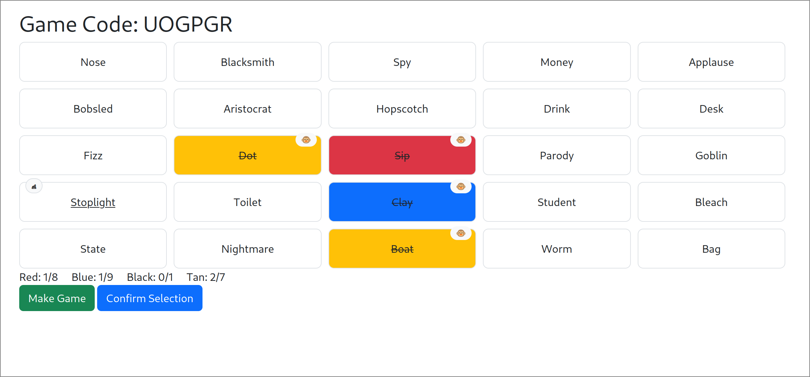

# Codenames
Replicates the board game codenames. Their official online website is at https://codenames.game.
This project is meant to be played with people who are already in communication and is thus much
less structured and closer to the experience of playing the board game.

## Features
- [x] codenames gameplay loop
    - live game updated with multiple players through web sockets
    - with minimal interface (e.i. not keeping track of turns to minimize buttons pressed)
    - communication / turns is dealt outside of the game 
- [x] various wordbanks to choose from
- [ ] upload picture board to website and have it populate the board
- [ ] option to save hints and guess order
- [ ] game history

## How to play (once the server is running)

- defer to the codename [rules](https://en.wikipedia.org/wiki/Codenames_(board_game)#Rules) for gameplay
1. navigate to the play menu
2. select all packs you want to play with
3. make game
4. select the appropriate role (spymasters will have to see the spymaster role view, all other players must not see the spymaster screen)

|Role | can see unrevealed words | can make new game | can confirm words | can select words |
|-----------|--------------------------|-------------------|-------------------|------------------|
|Spymaster | ✅ | ✅ | ✅| ✅ |
|Operative | ❌ | ✅ | ✅| ✅ |
|Viewer | ❌ | ❌ | ❌| ✅ |

5. Continue to game where other players can join the same game with the code
6. If a new game is made all other players will be able to go to that same next game with the same button
- New games will never have words that were previously used in games before it
    - this resets once a game is started from the play menu
    - this also means that a new game might not be able to be made

## technical notes
- this project is written with [fasthtml](https://github.com/AnswerDotAI/fasthtmlc)
    - a full stack python framework which leverages [htmx](https://htmx.org/) and [starlette](https://www.starlette.io/)
    - the main concept is using python object as html elements that are then converted by the library
- [SQLalchemy](https://www.sqlalchemy.org/) is also used as an ORM connected to a [SQLite](https://www.sqlite.org/) database for persistance
- websockets are used for fast updates

## how to run
- install python <= 3.12
- create a python env (optional)
- download python dependencies
    - `pip install -r requirements.txt`
- load the database 
    - `python manage.py load database` (in app directory)
- add word default word packs to the game
    - `python manage.py load cards` (in app directory)
- run the app
    - `python main.py` (in app directory)
- to add other word packs make a new line separated file like `app/cards/general.txt` and pass it and a tag name as flags to the load cards command
    - `python manage.py load cards --file_path cards/general.txt --tag general-words` (in app directory)
- this is a uvicorn app so it it can easily be hosted locally

